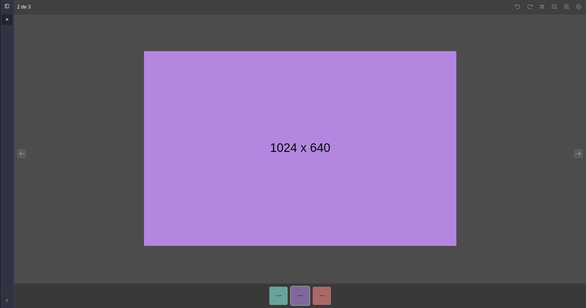

# GalleryFy

GalleryFy is a React library to show images in the gallery.

## Installation

* Node v14+
* NPM

```bash
npm install @deesouza/galleryfy
```



## Usage

```js
import { GalleryFy } from '@deesouza/galleryfy';

const images [
    'https://cdn.images.com/image-1.png',
    'https://cdn.images.com/image-2.png',
    'https://cdn.images.com/image-3.png',
];

/*

You can use images from assets

import image1 from '@assets/images/image-1.jpg';
import image2 from '@assets/images/image-2.jpg';
import image3 from '@assets/images/image-3.jpg';

const images = [
    image1, image2, image3
];

*/

const [openInImage, setOpenInImage] = useState(0);
const [open, setOpen] = useState(false);

function handleOpen(index: number) {
    setOpenInImage(index);
    setOpen(true);
}

<GalleryFy
    open={open}
    images={images}
    selectedImage={openInImage}
    handleClose={() => setOpen(false)}
/>

<div>
    {images.map((image, index) => (
        <div key={image} onClick={() => handleOpen(index)}>
            
        </div>
    ))}
</div>
``````