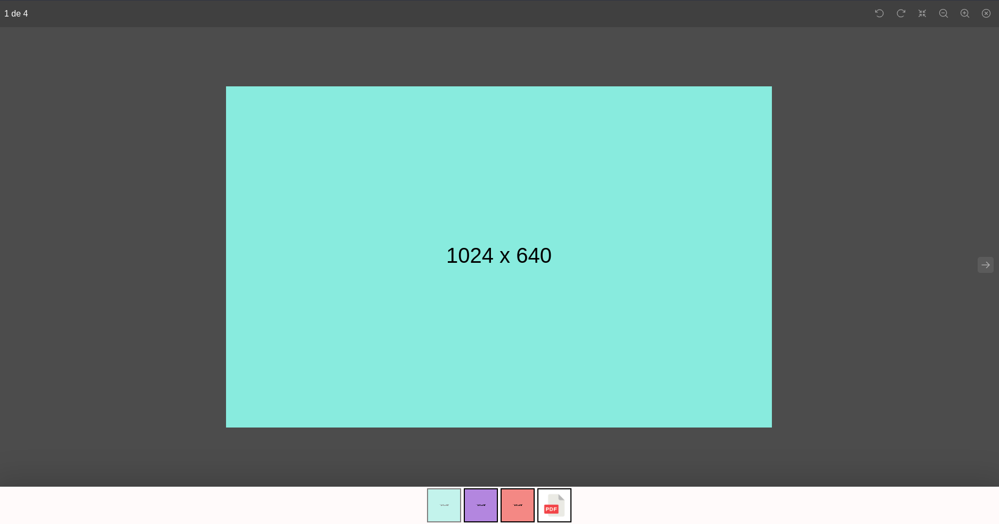

# GalleryFy

GalleryFy is a simple React library to show images and PDF files in the gallery.



## Prerequisites

* Node v14+
* NPM v6+

## Install

```bash
npm i @deesouza/galleryfy
```

## Usage

```jsx
export default function Home() {
  const images [
        'https://cdn.images.com/image-1.png',
        'https://cdn.images.com/image-2.png',
        'https://cdn.images.com/image-3.png',
    ];
  const pdf = "https://s29.q4cdn.com/175625835/files/doc_downloads/test.pdf";

  const [openIn, setOpenIn] = useState(0);
  const [open, setOpen] = useState(false);

  function handleOpen(index: number) {
    setOpenIn(index);
    setOpen(true);
  }

  const dataSource = [image1, image2, image3, pdf];

  return (
    <div>
      <GalleryFy
        open={open}
        dataSource={dataSource}
        startIn={openIn}
        handleClose={() => setOpen(false)}
      />

      <div>
        {dataSource.map((item, index) => (
          <div key={item} onClick={() => handleOpen(index)}>
            
          </div>
        ))}
      </div>
    </div>
  );
}
```

You can also use images from assets.

```js
  import image1 from '@assets/images/image-1.jpg';
  import image2 from '@assets/images/image-2.jpg';
  import image3 from '@assets/images/image-3.jpg';

  const images = [
      image1, image2, image3
  ];
```

## Features

- Zoom
- Draggable
- Rotate
- Thumbnails
- Navigation
- Image Viewer
- PDF Viewer

## Contributing

Contributions, issues and feature requests are welcome. Feel free to check [issues page](https://github.com/kefranabg/readme-md-generator/issues).

## License

Copyright © 2023 [Diego Souza](https://github.com/deesouza).
This project is [MIT](./LICENSE) licensed.